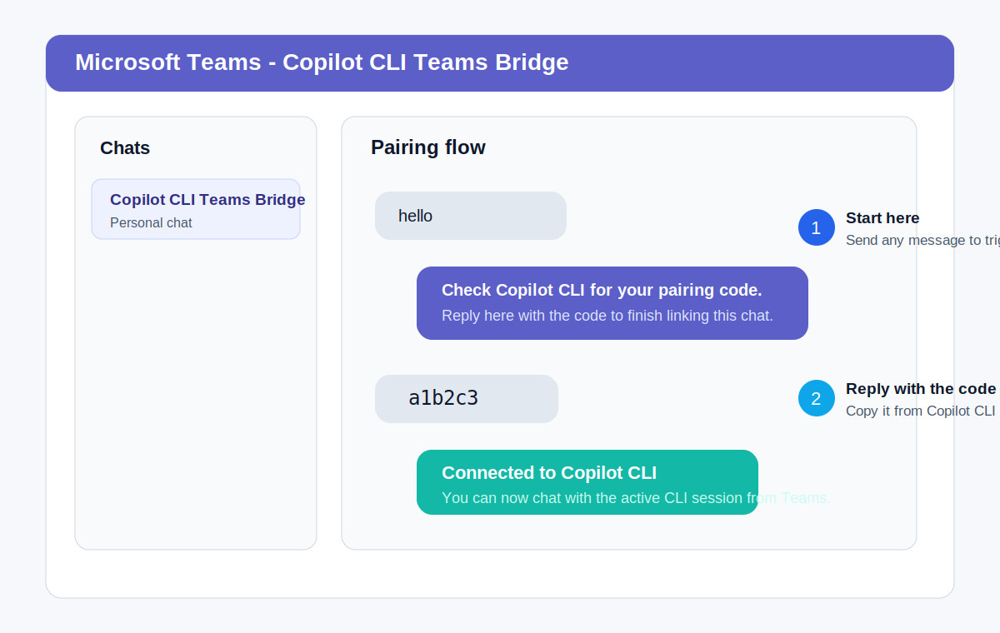
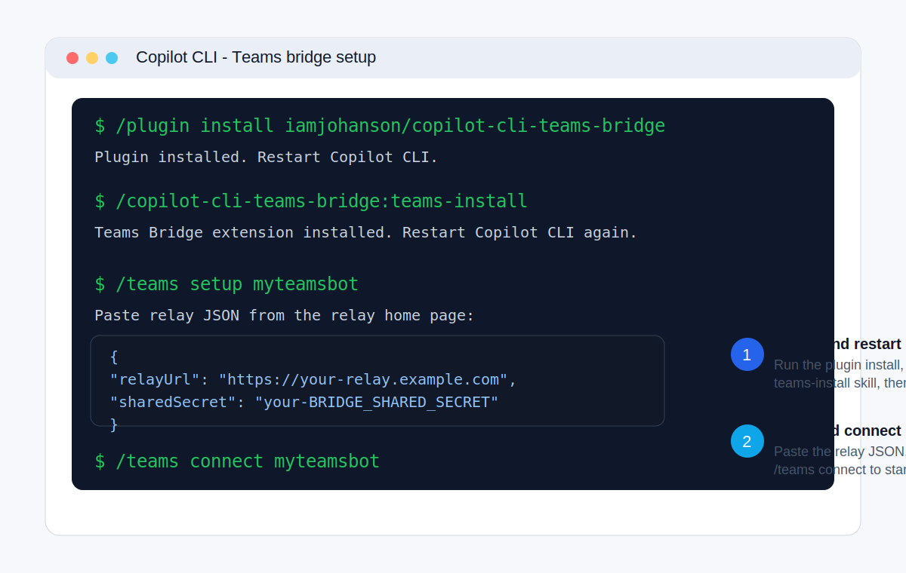
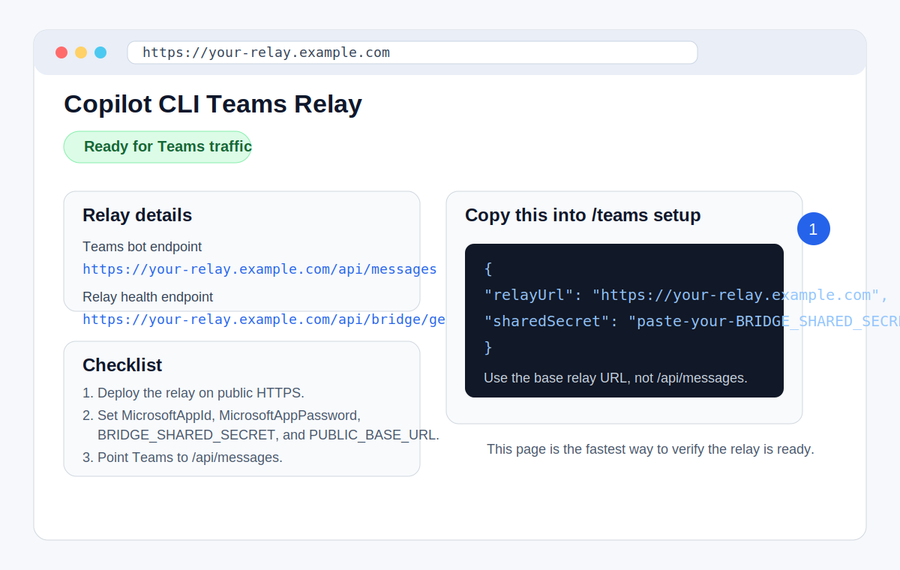
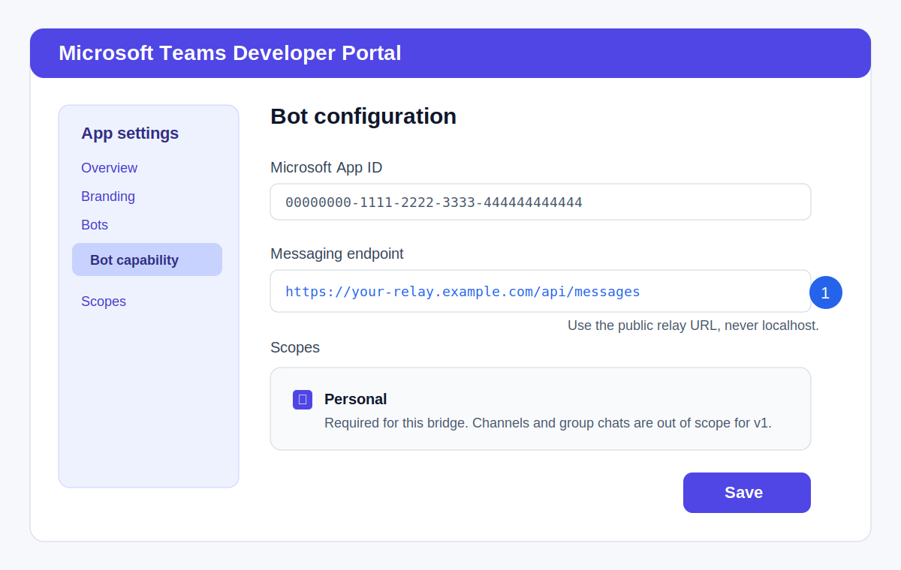

# Copilot CLI Teams Bridge

A GitHub Copilot CLI extension plus a small relay service that lets you chat with one Copilot CLI session from Microsoft Teams personal chat.

## Start here if you're the end user

If someone else is doing the technical setup for you, you do **not** need to understand the relay, Teams Developer Portal, or bot registration.

Ask your technical owner for these 3 things:

1. the Teams app installed for you
2. Copilot CLI with this extension installed
3. a JSON block like this:
   ```json
   {
     "relayUrl": "https://YOUR-RELAY-HOST",
     "sharedSecret": "YOUR-BRIDGE-SHARED-SECRET"
   }
   ```

Once you have those 3 things, your setup is:

1. Open the Teams app and send it one message like `hello`.
2. Open Copilot CLI.
3. Run:
   ```
   /teams setup myteamsbot
   ```
4. Paste the JSON exactly as you received it.
5. Run:
   ```
   /teams connect myteamsbot
   ```
6. Go back to Teams and send one more message.
7. When Copilot CLI shows a pairing code, paste that code into Teams.
8. Start chatting with Copilot from Teams.

If you do not have the JSON block yet, send the **Technical owner setup** section below to the person helping you.



## For technical owners

> **Important**
> This README reflects the latest Teams workflow. If your checkout still only contains the older Telegram-era files, sync to the Teams branch before following the relay steps:
>
> ```bash
> git fetch origin
> git switch --track origin/copilot/update-telegram-to-teams
> ```

### What the latest Teams build includes

- `extension.mjs` - Copilot CLI extension that adds the `/teams` command
- `relay/server.mjs` - public HTTPS relay that receives Teams traffic and exposes an authenticated bridge API back to the extension
- `skills/teams-install/SKILL.md` - install skill used by the plugin

### Current scope

This version is intentionally focused on the smallest reliable Teams experience:

- Microsoft Teams **personal chat**
- text messages both ways
- pairing code confirmation
- typing indicator and tool-status updates
- multi-connection support inside Copilot CLI

Not included in v1:

- channel conversations
- group chats
- inbound file uploads
- outbound image or file delivery

### Before you start

You need:

- [GitHub Copilot CLI](https://github.com/github/copilot-cli) installed and working
- extensions enabled in Copilot CLI
- Node.js 18+
- a Microsoft 365 tenant where you can install or sideload a custom Teams app
- a Microsoft App ID and bot registration for Teams
- a public HTTPS URL for the relay

> **Local development note**
> Even when you run the relay on your own machine and sideload the Teams app only for yourself, Teams still requires:
>
> 1. a real Microsoft App ID / bot registration
> 2. a public HTTPS URL
>
> A tunnel solves reachability. It does **not** remove the Teams registration requirement.

### Technical owner setup

1. Install the Copilot CLI extension.
2. Run the relay on a public HTTPS URL.
3. Configure a Teams personal bot app to use that relay.
4. Install the Teams app and send it one message.
5. Save the relay connection in Copilot CLI with `/teams setup <name>`.
6. Connect with `/teams connect <name>` and complete pairing.

The screenshots below are representative examples of the screens and values you should expect.

### Detailed setup with screenshots

#### 1. Install the Copilot CLI extension

#### Plugin install

1. In Copilot CLI, run:
   ```
   /plugin install iamjohanson/copilot-cli-teams-bridge
   ```
2. Restart Copilot CLI.
3. Run:
   ```
   /copilot-cli-teams-bridge:teams-install
   ```
4. Restart Copilot CLI again so the `/teams` command is loaded.

#### Manual install

1. Clone this repo.
2. Copy `extension.mjs` into your Copilot extensions directory:
   ```bash
   mkdir -p ~/.copilot/extensions/copilot-cli-teams-bridge
   cp extension.mjs ~/.copilot/extensions/copilot-cli-teams-bridge/
   ```
3. Restart Copilot CLI.



#### 2. Run the relay service

The relay is the public endpoint Teams talks to. The Copilot CLI extension also uses it for authenticated bridge calls.

1. Install dependencies:
   ```bash
   npm install
   ```
2. Set the relay environment variables:

| Variable | Required | Purpose |
|---|---|---|
| `MicrosoftAppId` | Yes | Microsoft App ID used by the Teams bot |
| `MicrosoftAppPassword` | Yes | Secret or password for that Teams bot |
| `BRIDGE_SHARED_SECRET` | Yes | Shared secret the Copilot CLI extension sends to the relay |
| `PUBLIC_BASE_URL` | Yes | Public HTTPS root URL for the relay, with no trailing slash |
| `TEAMS_BOT_NAME` | No | Friendly bot name shown by the relay |
| `PORT` | No | Local relay port, default `3978` |

3. Start the relay:
   ```bash
   npm run relay:start
   ```
4. Open the relay home page in your browser.

The home page should show:

- whether the relay is fully configured
- the Teams messaging endpoint: `https://YOUR-RELAY-HOST/api/messages`
- the relay health endpoint: `https://YOUR-RELAY-HOST/api/bridge/getMe`
- the exact JSON block to paste into `/teams setup`



#### 3. Create or update the Teams app

1. Open the **Microsoft Teams Developer Portal**.
2. Create a new app or open the app you want to use for this bridge.
3. In the **Bots** section, add a bot that uses your Microsoft App ID.
4. Set the bot messaging endpoint to:
   ```
   https://YOUR-RELAY-HOST/api/messages
   ```
5. Turn on the **Personal** scope.
6. Save the app.

> **Use the public relay host**
> The messaging endpoint must use your public relay URL or tunnel URL. Do not use `localhost`.



#### 4. Install the Teams app and send the first message

1. Install or sideload the Teams app for yourself.
2. Open it in **personal chat**.
3. Send any short message such as `hello`.

That first message matters because it lets the relay store your personal chat reference for later replies from Copilot CLI.

#### 5. Save the relay connection in Copilot CLI

1. In Copilot CLI, run:
   ```
   /teams setup myteamsbot
   ```
2. Paste the JSON shown on the relay home page:
   ```json
   {
     "relayUrl": "https://YOUR-RELAY-HOST",
     "sharedSecret": "YOUR-BRIDGE-SHARED-SECRET"
   }
   ```

Notes:

- `relayUrl` is the relay **base URL**
- do **not** paste `/api/messages`
- do **not** paste `/api/bridge/getMe`
- `sharedSecret` must exactly match `BRIDGE_SHARED_SECRET`

#### 6. Connect and complete pairing

1. In Copilot CLI, run:
   ```
   /teams connect myteamsbot
   ```
2. Go back to Teams and send the bot any message.
3. The bot asks you to check Copilot CLI for a pairing code.
4. Copy the pairing code from Copilot CLI.
5. Paste that pairing code into the Teams chat.
6. Messages now flow both ways between Teams and the connected Copilot CLI session.

### Fastest local-first workflow

If you want to develop locally:

1. Install the extension locally.
2. Run the relay locally with `npm run relay:start`.
3. Expose the relay through a public HTTPS tunnel such as:
   - Visual Studio Dev Tunnels
   - ngrok
   - Cloudflare Tunnel
   - any CLI-managed tunnel that gives you a public HTTPS URL
4. Set `PUBLIC_BASE_URL` to that tunnel URL.
5. Point the Teams bot messaging endpoint to:
   ```
   https://YOUR-TUNNEL-HOST/api/messages
   ```
6. Sideload the Teams app for yourself.
7. Send the app one message.
8. Run `/teams setup <name>` and paste the JSON from the relay home page.
9. Run `/teams connect <name>` and finish pairing.

### Copy/paste handoff message for non-technical users

If you are the technical owner, you can send this message as-is after the relay and Teams app are ready:

> Open the **Copilot CLI Teams Bridge** app in Teams and send `hello`.
>
> Then open Copilot CLI and run:
> ```
> /teams setup myteamsbot
> ```
>
> Paste this exactly:
> ```json
> {
>   "relayUrl": "https://YOUR-RELAY-HOST",
>   "sharedSecret": "YOUR-BRIDGE-SHARED-SECRET"
> }
> ```
>
> Then run:
> ```
> /teams connect myteamsbot
> ```
>
> Go back to Teams and send one more message. Copilot CLI will show you a pairing code. Copy that code into Teams and you are done.

Replace `myteamsbot`, `YOUR-RELAY-HOST`, and `YOUR-BRIDGE-SHARED-SECRET` with the real values before sending it.

## Commands

| Command | Description |
|---|---|
| `/teams setup <name>` | Register a Teams relay connection with a local alias |
| `/teams connect <name>` | Connect this session to the named Teams bridge |
| `/teams connect` | List registered bridges |
| `/teams disconnect` | Disconnect from the current Teams bridge |
| `/teams status` | Show registered bridges and paired chat count |
| `/teams remove <name>` | Remove a saved Teams bridge |

## Troubleshooting

- **The Teams app does not answer** - confirm the bot messaging endpoint is `https://YOUR-RELAY-HOST/api/messages`
- **`/teams setup` fails** - confirm the relay URL is public HTTPS, the shared secret matches `BRIDGE_SHARED_SECRET`, and the URL is your public host rather than `localhost`
- **`/teams connect` fails** - open the relay home page and confirm it shows as configured
- **The relay health endpoint fails** - check `https://YOUR-RELAY-HOST/api/bridge/getMe`
- **Pairing code expired** - send a new message in Teams to request a fresh code

## Security

The Copilot extension stores relay connection details, including the shared secret, in `bots.json` with restricted file permissions.

- do not commit `bots.json`
- do not share the relay secret broadly
- if the secret is exposed, generate a new `BRIDGE_SHARED_SECRET`, then run `/teams remove <name>` and `/teams setup <name>` to save the new secret

The relay stores Teams conversation references in `relay/.data/bridge-store.json` by default so it can proactively send replies back into Teams personal chat.
